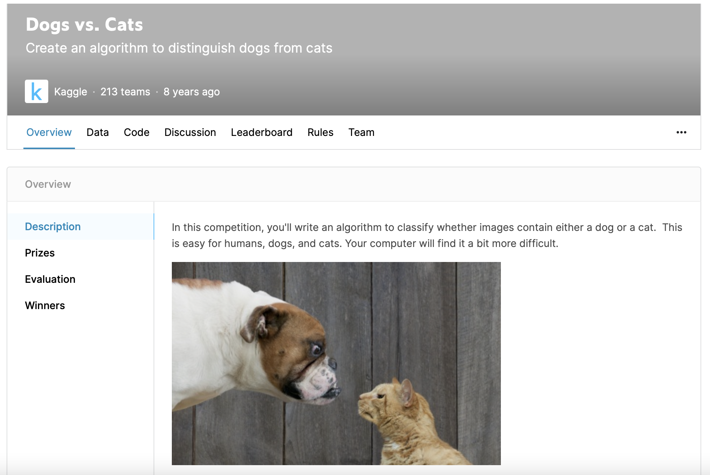
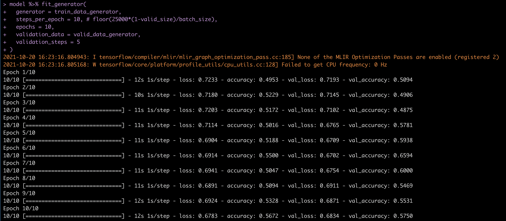
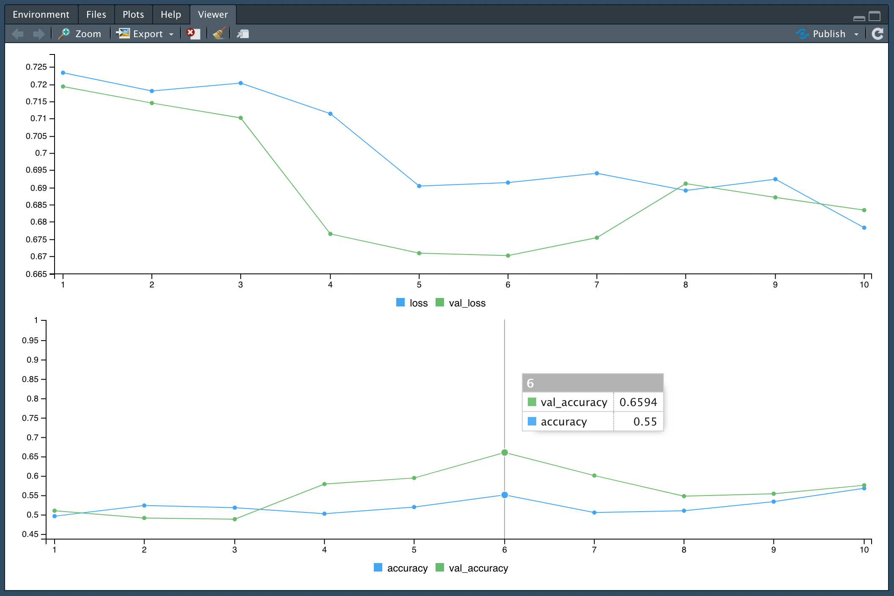
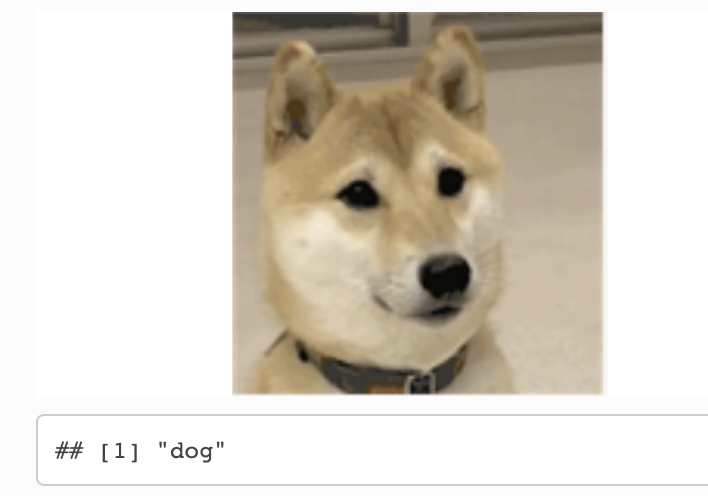

# Dogs vs Cats

Using [Tensorflow-R](https://tensorflow.rstudio.com) to finetune Resnet-50 on [Dogs and Cats classification](https://www.kaggle.com/c/dogs-vs-cats). 

For Statistical Computing Course 2021 fall in CUFE.



## Install & Setup

https://tensorflow.rstudio.com
https://github.com/rstudio/tensorflow

```R
# install R tensorflow package
devtools::install_github("rstudio/tensorflow")
library(tensorflow)
tensorflow::install_tensorflow(
  method = "conda",
  conda = "/opt/homebrew/Caskroom/miniforge/base/bin",
  envname = "r-reticulate"
)
```

```R
# activate conda environment
reticulate::use_condaenv(
  condaenv = "r-reticulate",
  conda = "/opt/homebrew/Caskroom/miniforge",
  required = TRUE
)
# check conda config
reticulate::py_config()
```

## Params Config

```R
# pixel
size <- 128
# valid_size
valid_size <- 0.1
# random seed
seed <- 1234
# batch_size
batch_size <- 64
```

## Generate Model

```R
# load tensorflowAPI：Keras
library(keras)

# load pretrained resnet50
base_model <- application_resnet50(include_top=F, weights='imagenet', 
                                   input_shape = c(size, size, 3))
# frozen pretrained model
for (layes in base_model$layers)
  layes$trainable <- F

# add pooling & FC layers
model <- keras_model_sequential() %>% 
  base_model %>%
  layer_average_pooling_2d() %>%
  layer_flatten() %>%
  layer_dropout(rate = 0.2) %>%
  layer_dense(2, activation = 'softmax')

# display model structure
summary(model)

# set optimizer, loss function, evaluation metrics
model %>% compile(
  optimizer = 'Adam',
  loss = 'categorical_crossentropy',
  metrics = "accuracy"
)
```

## Data Generator

https://www.kaggle.com/c/dogs-vs-cats/data

```R
setwd("your_data_path/dogs-vs-cats")

# make image_generator & data augment
image_generator <- image_data_generator(
  validation_split = valid_size,
  rotation_range = 30,
  width_shift_range = 0.1,
  height_shift_range = 0.1,
  zoom_range = 0.1,
  rescale = 1/255
)

# make train_data_generator
train_data_generator <- flow_images_from_directory(
  directory = "dogs-vs-cats/train_2class/", 
  generator = image_generator,
  target_size = c(size, size),
  batch_size = batch_size,
  interpolation = "bicubic",
  subset = "training",
  shuffle = TRUE,
  seed = seed
)

# make valid_data_generator
valid_data_generator <- flow_images_from_directory(
  directory = "dogs-vs-cats/train_2class/", 
  generator = image_generator,
  target_size = c(size, size),
  batch_size = batch_size,
  interpolation = "bicubic",
  subset = "validation",
  shuffle = TRUE,
  seed = seed
)
```

## Train

```R
model %>% fit_generator(
  generator = train_data_generator,
  steps_per_epoch = floor(25000*(1-valid_size)/batch_size),
  epochs = 10,
  validation_data = valid_data_generator,
  validation_steps = 10
)

model %>% save_model_hdf5("ResNet50")
```





## Evaluate

```R
model %>% load_model_weights_hdf5("ResNet50")
model %>% evaluate_generator(
  generator = valid_data_generator,
  steps = 10
)
##      loss  accuracy 
## 0.2537442 0.9312500
```

## Inference

```R
# function for plot
img_plot <- function(file){
  img <- EBImage::readImage(file)
  EBImage::display(img)
}
# function for inference
inference <- function(file, size = 128){
  img_plot(file)
  img <- keras::image_load(file, target_size = c(size, size),
                              interpolation = "bicubic")
  x <- keras::image_to_array(img)
  x <- x / 255
  x <- reticulate::array_reshape(x[, , 1:3], c(1, size, size, 3))
  is_dog <- model %>% 
    predict(x) %>% 
    k_argmax()
  is_dog_str <- ifelse(is_dog, 'dog', 'cat')
  print(is_dog_str)
}
```

```R
# model %>% load_model_weights_hdf5("ResNet50")
setwd("your_data_path")
for(pic in list.files("./"))
  inference(pic)
```


